# Amazon Cognito Setup

## Create A User Pool
1. Go to the [Amazon Cognito console](https://console.aws.amazon.com/cognito). You might be prompted for your AWS credentials.
2. Choose **Manage User Pools**.
3. In the top-right corner of the page, choose **Create a user pool**.
4. Provide a name for your user pool, and choose **Review defaults** to save the name.
  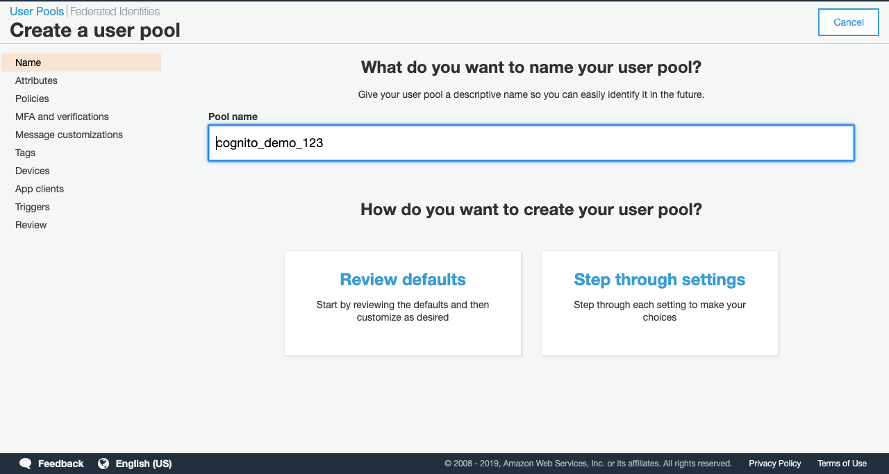
5. Scroll down and choose **Create pool**.
  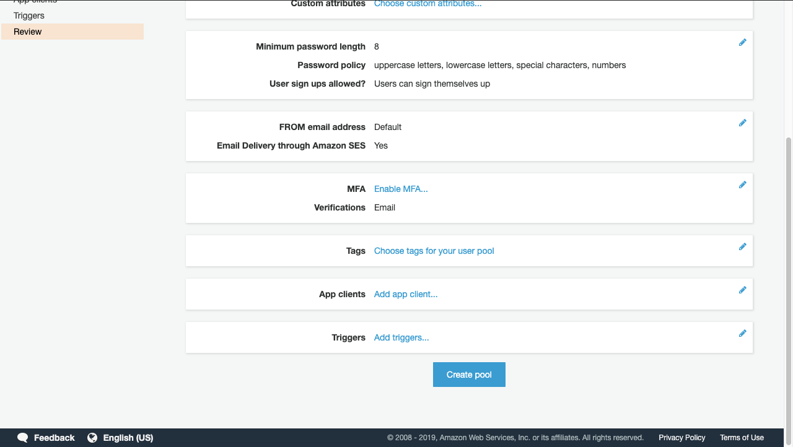

## Add an App to Enable the Hosted Web UI
1. On the navigation bar on the left-side of the page, choose **App clients** under **General settings**.
  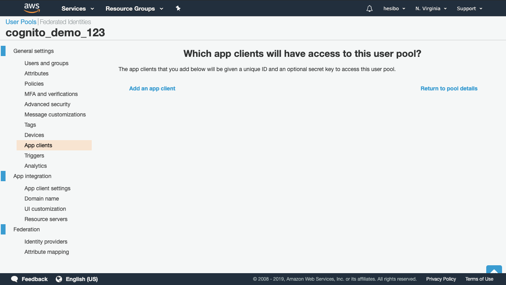
2. Choose **Add an app client**.
3. Give your app a name.
4. Clear the option **Generate client secret** for the purposes of this getting started exercise, as it would not be secure to send it on the URL using client-side JavaScript.
5. Choose **Create app client**.
  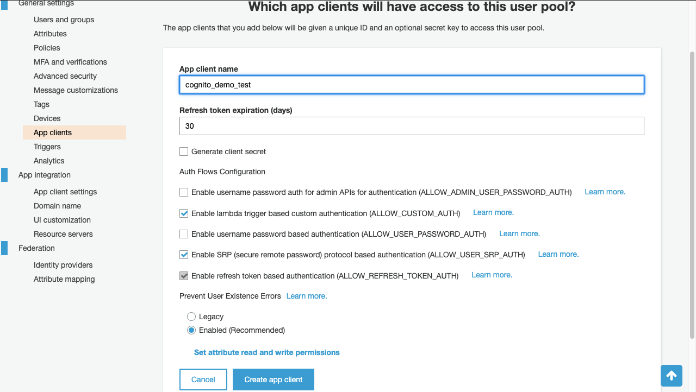
6. Note the **App client ID**.<br/><a name="appClientId">**appClientId**</a>
  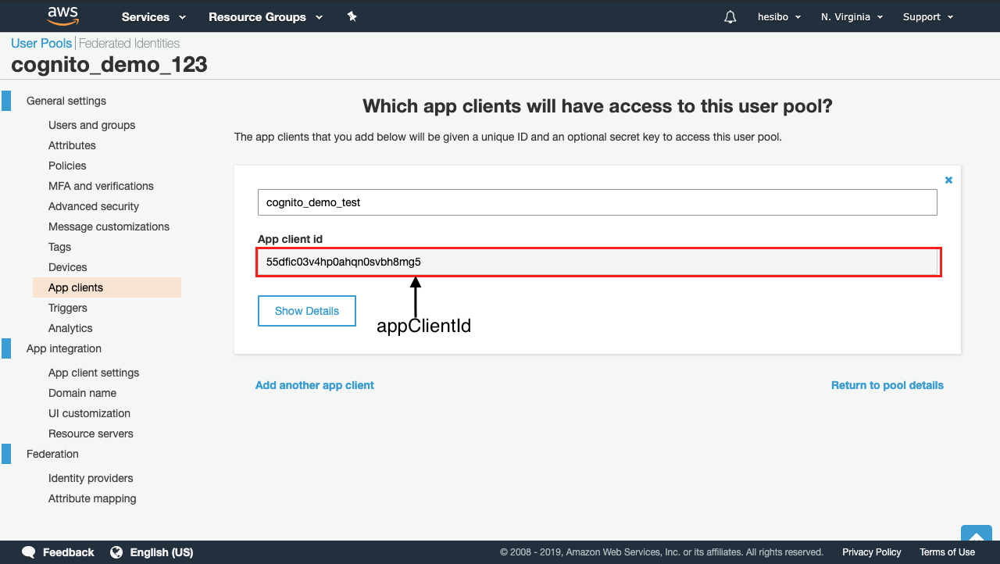
7. On the navigation bar on the left-side of the page, choose **App client settings** under **App integration**.
8. Configure the **App client settings** like the following screen, then choose **Save changes**.
  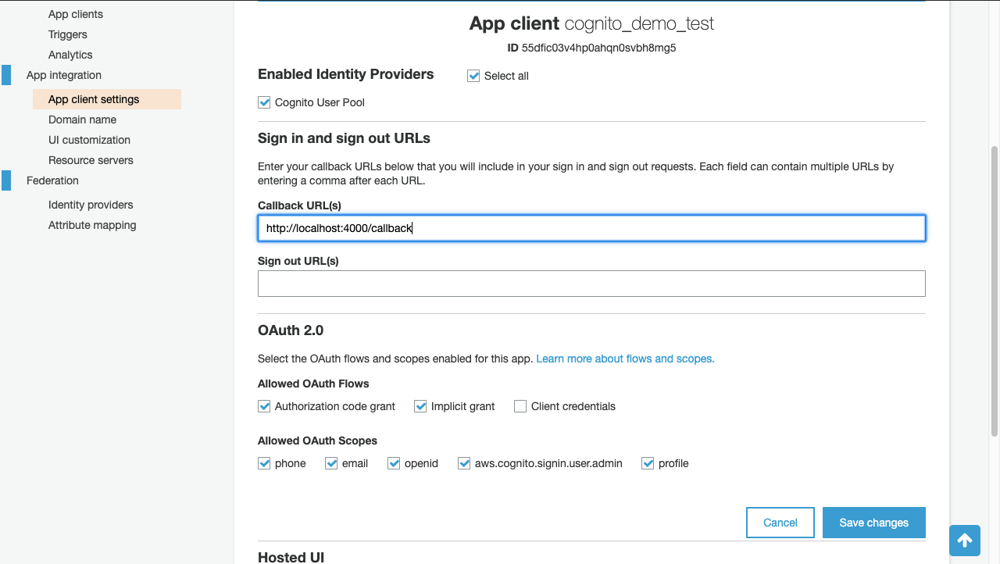
9. On the navigation bar on the left-side of the page, choose **Domain name** under **App integration**.
10. Configure the domain and choose **Save changes**.
  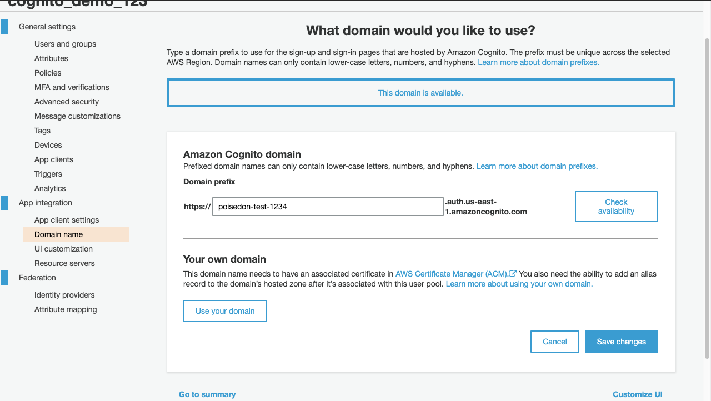
11. On the navigation bar on the left-side of the page, choose **App integration**. Note the **Domain**. <br/><a name="cognitoDomain">**cognitoDomain**</a>
  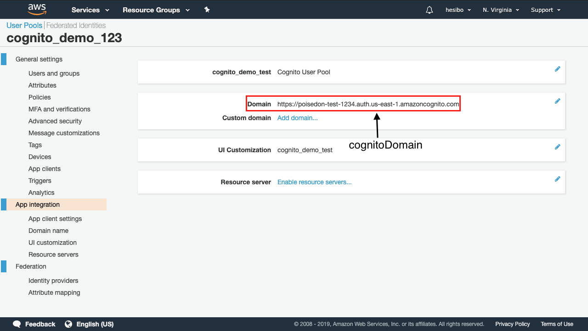

## Add Social Sign-in to a User Pool
You can simply refer this [document](https://docs.aws.amazon.com/cognito/latest/developerguide/cognito-user-pools-configuring-federation-with-social-idp.html). I will provide steps how to integrate Google social Sign-in.

1. Create a [developer account with Google](https://developers.google.com/identity) if you don't have.
2. [Sign in](https://developers.google.com/identity/sign-in/web/sign-in) with your Google credentials.
3. Choose **CONFIGURE A PROJECT**.
  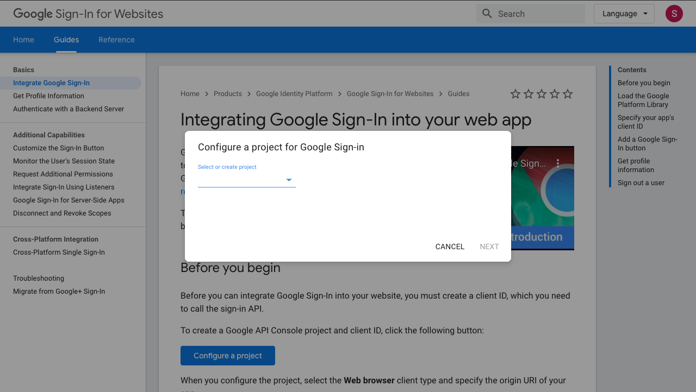
4. Choose an existing project or choose **Create a new project** to use a new project.
5. Type in your product name if need and choose **NEXT**.
6. Choose **Web browser** from the **Where are you calling from?** drop-down list, and Type your user pool domain(refer to [cognitoDomain](#cognitoDomain)) into **Authorized JavaScript origins**.
  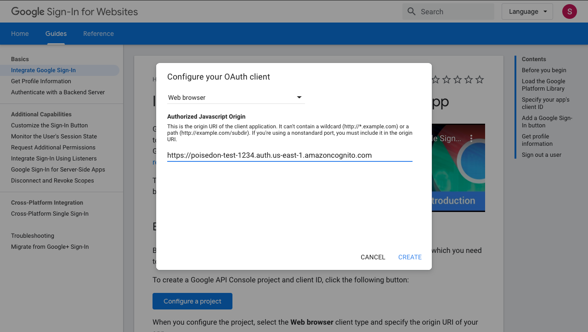
7. Choose **CREATE** and then choose **DONE**.
8. [Sign in](https://console.developers.google.com/) to the Google Console.
9. On the left navigation bar, choose **Credentials**. Create your OAuth 2.0 credentials by choosing **OAuth client ID** from the **Create credentials** drop-down list.
  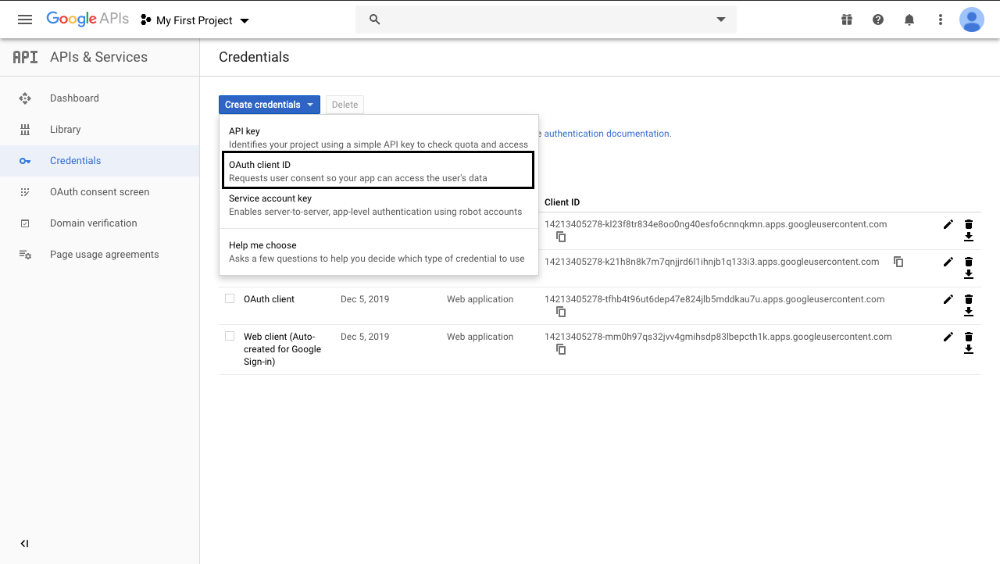
10. Choose **Web application**, type the name, type your user pool domain(refer to [cognitoDomain](#cognitoDomain)) into **Authorized JavaScript origins**, type your user pool domain(refer to [cognitoDomain](#cognitoDomain)) with the **/oauth2/idpresponse** endpoint into **Authorized Redirect URIs**.
  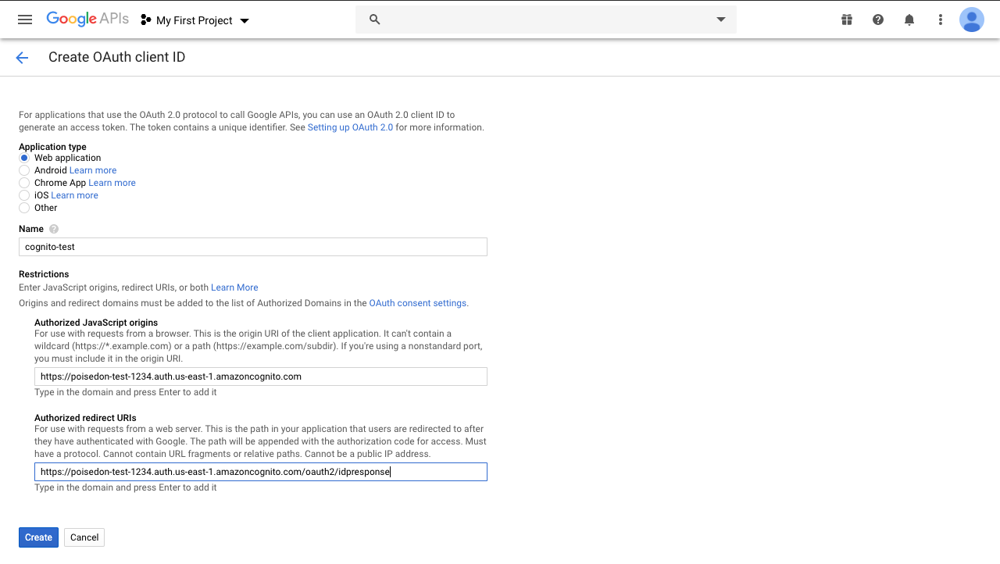
11. Choose **Create** and note the **OAuth client ID** and **client secret**. <br/><a name="googleClientId">**googleClientId**</a> and <a name="googleClientSecret">**googleClientSecret**</a>
  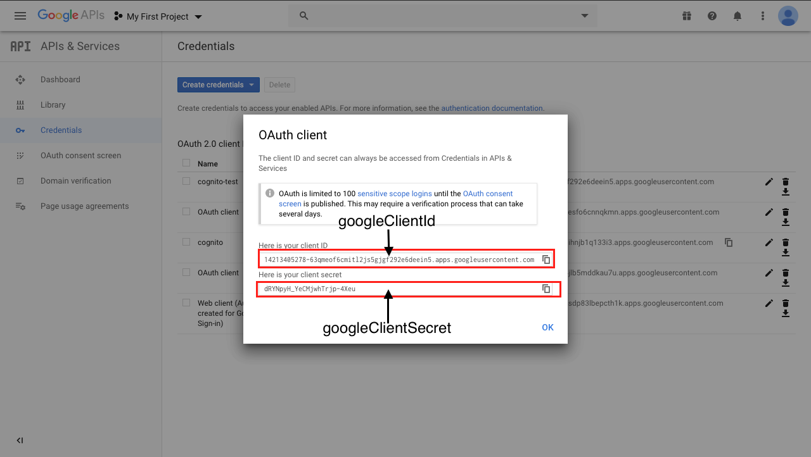
12. Go to [User Pools - Amazon Cognito](https://console.aws.amazon.com/cognito/users). Choose the user pool you have just created.
13. On the left navigation bar, choose **Identity providers** under **Federation**. Choose **Google**. Type the [googleClientId](#googleClientId) under *Google app ID*, type the [googleClientSecret](#googleClientSecret) under **App secret**, for **Authorize scope** simply follow the example. Choose **Enable Google**.
  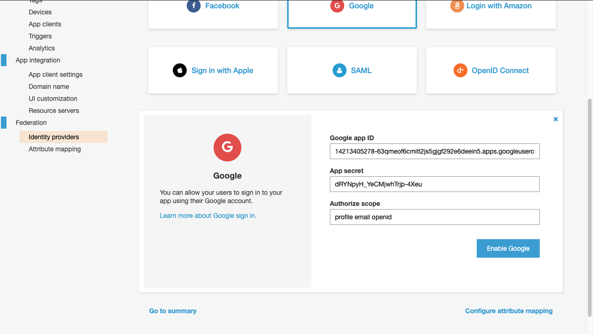
14. On the left navigation bar, choose **Attribute mapping** under **Federation**. Configure the mapping for **Google**, you can only add mapping for email for testing. Then choose **Save changes**.
  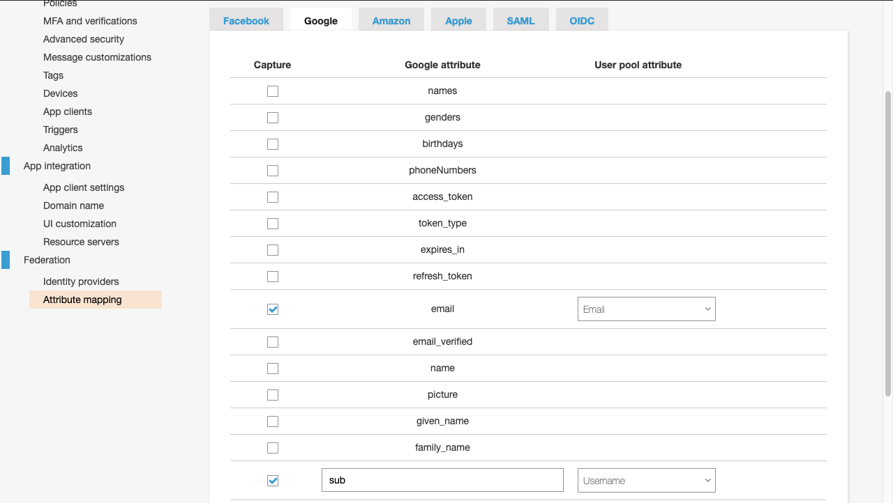
15. On the navigation bar on the left-side of the page, choose **App client settings** under **App integration**. Enabled all Identity provider via choose **Select all**, then choose **Save changes**.

## Adding OIDC Identity Providers to a User Pool
You can simply refer this [document](https://docs.aws.amazon.com/cognito/latest/developerguide/cognito-user-pools-oidc-idp.html). I will provide steps how to integrate Microsoft Azure Active Directory.

1. Sign in to the [Azure portal](https://portal.azure.com/).
2. Select **App registrations**.
  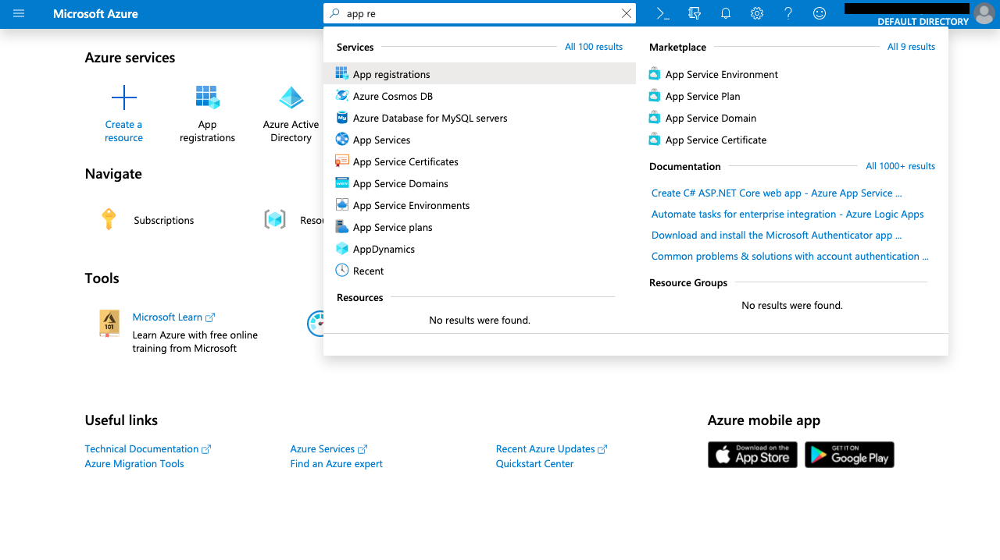
3. Choose **New registration**, type the name, choose **Accounts in any organizational directory (Any Azure AD directory - Multitenant) and personal Microsoft accounts (e.g. Skype, Xbox)** under **Supported account types**, then choose **Register**.
  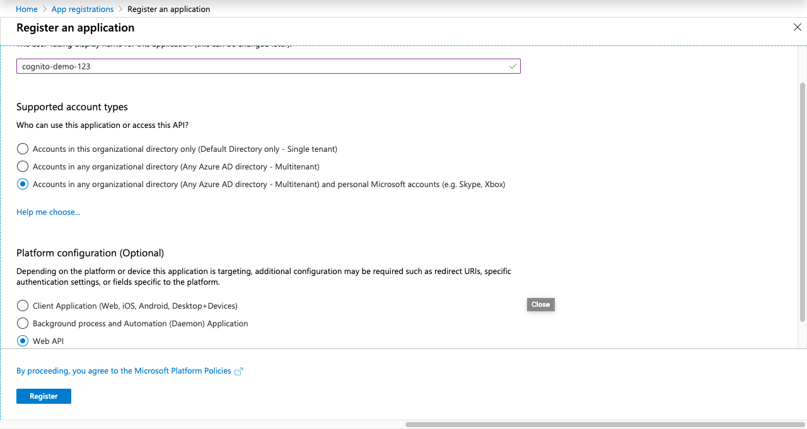
4. On the navigation bar on the left-side of the page, choose **Authentication**, choose **Add a platform**, choose **Web**, type your user pool domain(refer to [cognitoDomain](#cognitoDomain)) with the **/oauth2/idpresponse** endpoint into **Redirect URIs**. Enable **Implicit grant** and then choose **Configure**.
  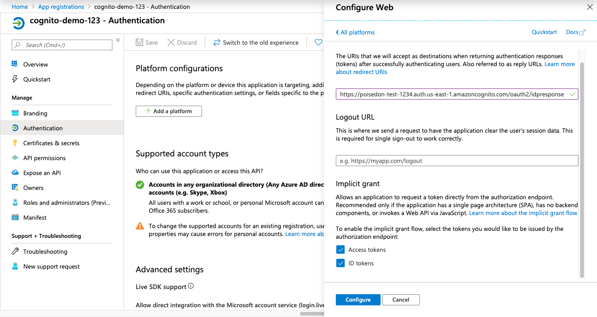
5. On the navigation bar on the left-side of the page, choose **Overview**. Note the **Application (client) ID** and **Directory (tenant) ID**. <br/><a name="microsoftClientId">**microsoftClientId**</a> and <a name="microsoftTenantId">**microsoftTenantId**</a>
  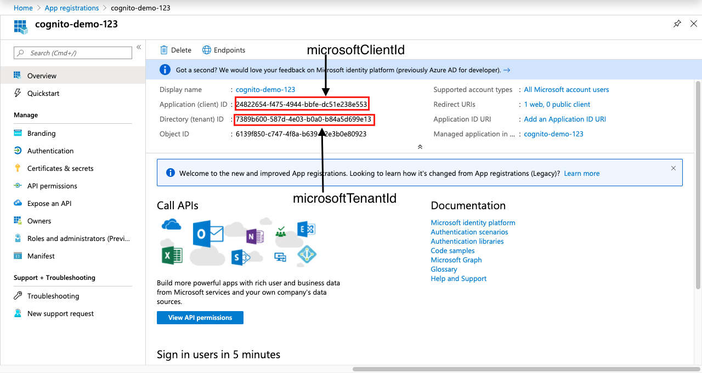
6. On the navigation bar on the left-side of the page, choose **Certificates & secrets**, choose **New client secret** to add a client secret. Note the client secret after success. <br/><a name="microsoftClientSecret">**microsoftClientSecret**</a>
  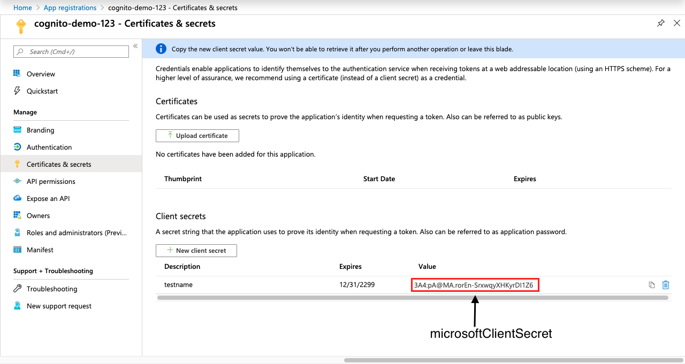
7. Go to [User Pools - Amazon Cognito](https://console.aws.amazon.com/cognito/users). Choose the user pool you have just created.
8. On the left navigation bar, choose **Identity providers** under **Federation**. Choose **OpenID Connect**. Type the [microsoftClientId](#microsoftClientId) under **Client ID**. Type the [microsoftClientSecret](#microsoftClientSecret) under **Client secret (optional)**. For Issuer please use `https://sts.windows.net/{tenant_id}`, the `tenant_id` is [microsoftTenantId](#microsoftTenantId). Other configuration you can refer the following screen. Last, choose **Create provider**
  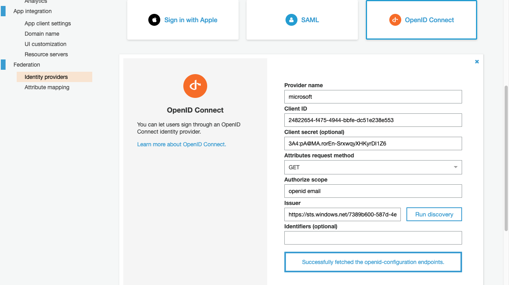
9. On the left navigation bar, choose **Attribute mapping** under **Federation**. Configure the mapping for **OIDC**, you can only add mapping for email for testing. Then choose **Save changes**.
  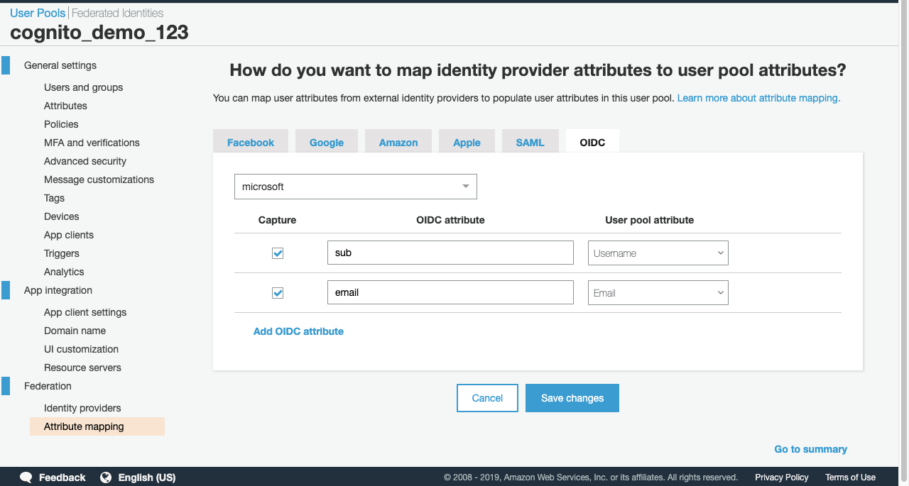
10. On the navigation bar on the left-side of the page, choose **App client settings** under **App integration**. Enabled all Identity provider via choose **Select all**. For **Callback URL(s)**, you should add an url using user pool domain(refer to [cognitoDomain](#cognitoDomain)) with the **/oauth2/idpresponse** endpoint. Last, choose **Save changes**.
  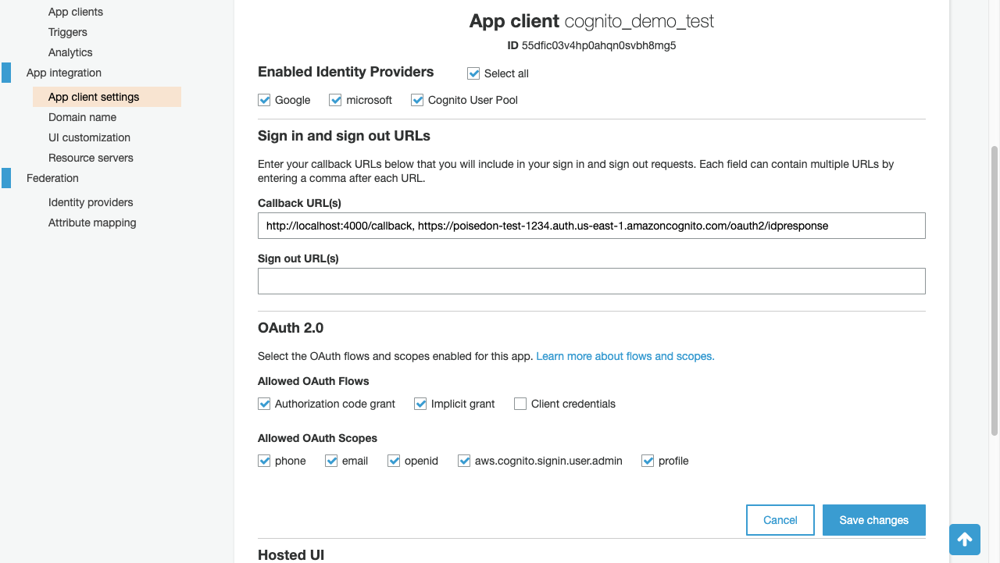

## Callback server
1. You need to start the authentication callback server before verification, Go to `authentication` folder in submission root folder. You need to step up the following environment variables:
    - COGNITO_DOMAIN: The Cognito Domain, same as [cognitoDomain](#cognitoDomain)
    - CLIENT_ID: The App client id, same as [appClientId](#appClientId)
2. Just run the following commands:
    ```
    npm install
    export COGNITO_DOMAIN=<COGNITO_DOMAIN>
    export CLIENT_ID=<CLIENT_ID>
    npm start
    ```
3. The callback server will listen on port `4000`.

## Usage
1. On the navigation bar on the left-side of the page, choose **App client settings** under **App integration**. Scroll down and choose **Launch Hosted UI**, you can perform sign in using username/password, via google account, or OpenId provided by Microsoft Azure Active Directory.
  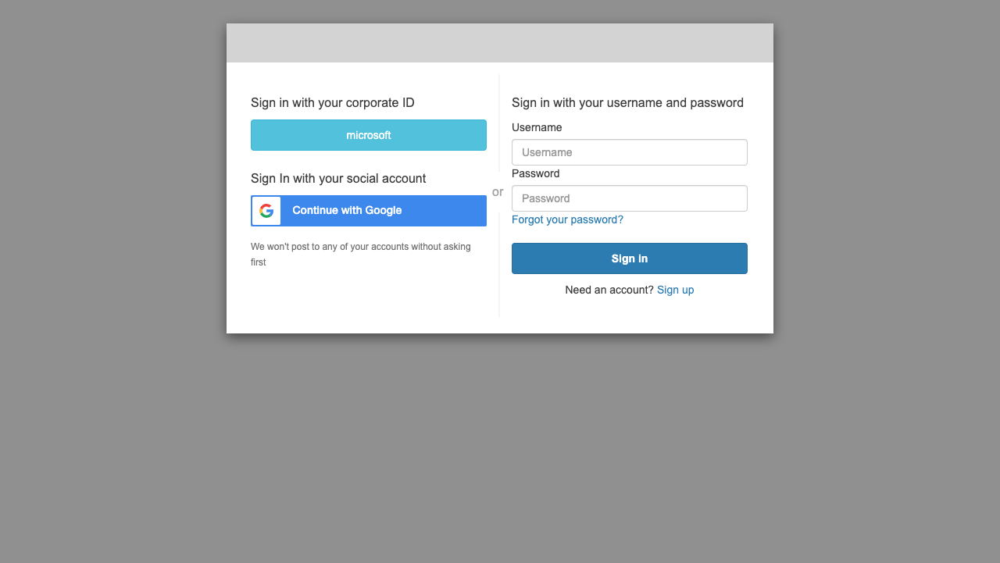
2. First you can sign up a new account, click **Sign up** link under **Sign in** button, fill the form and choose **Sign up** button. For testing, you can skip the verification step. Go to [User Pools - Amazon Cognito](https://console.aws.amazon.com/cognito/users). Choose the user pool you have just created.
3. On the navigation bar on the left-side of the page, choose **Users and groups** under **General settings**, you would find a new user you just created. Choose that and click **Confirm User** in the user detail page.
  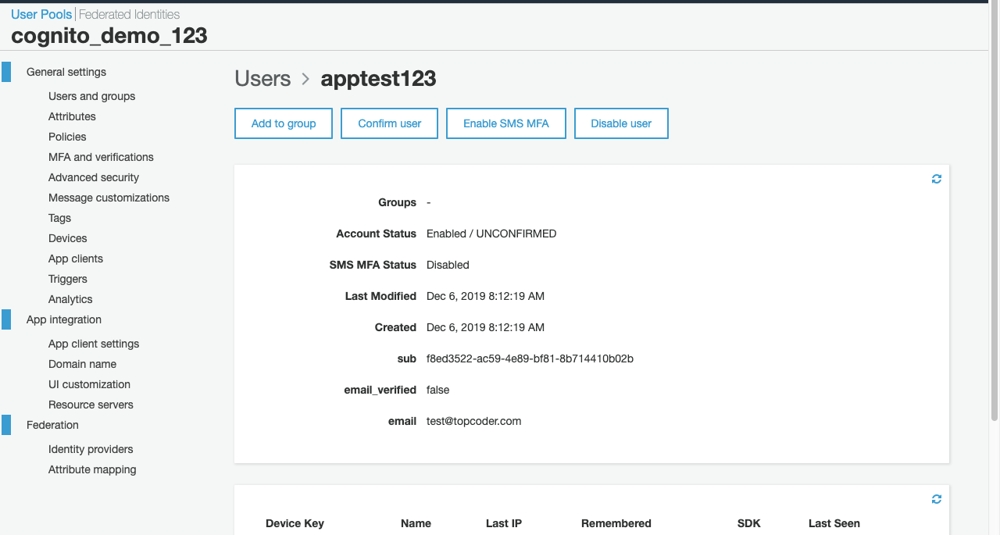
5. Now you can sign in using the new user you just created. Simply use this [Hosted UI](https://poisedon-test-1234.auth.us-east-1.amazoncognito.com/login?client_id=55dfic03v4hp0ahqn0svbh8mg5&response_type=code&scope=aws.cognito.signin.user.admin+email+openid+phone+profile&redirect_uri=http://localhost:4000/callback) for testing.
6. you can sign in using username/password, via google account, or OpenId provided by Microsoft Azure Active Directory. Once success, you will redirect to response page containing token information.
  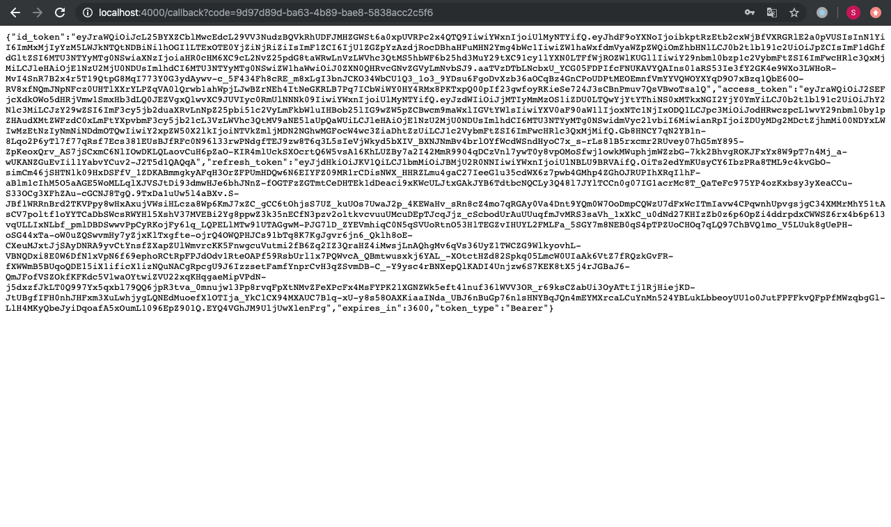

